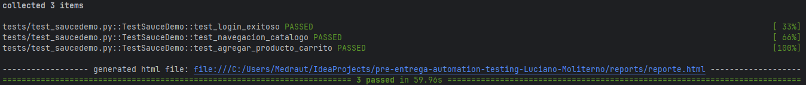
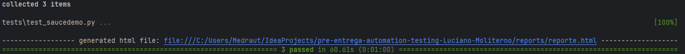
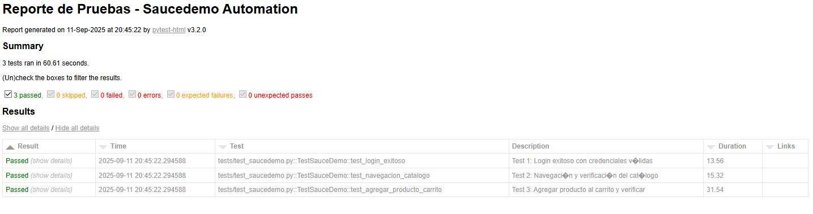
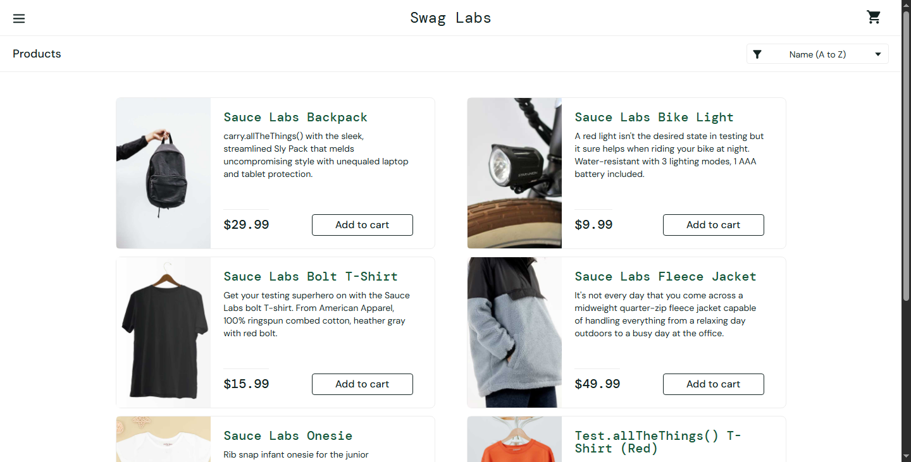
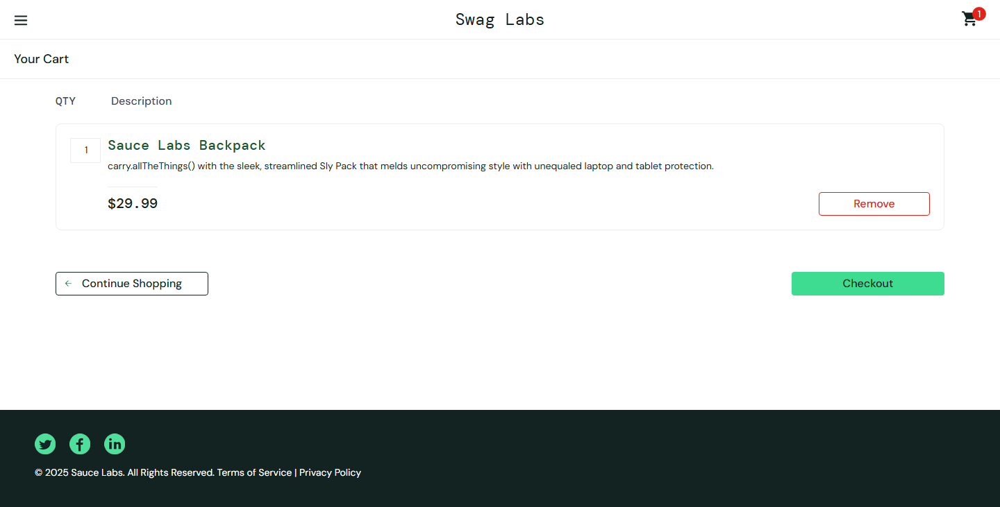

# Automation Testing - Saucedemo.com

## Propósito del Proyecto
Este proyecto automatiza pruebas de funcionalidad para la aplicación web saucedemo.com, cubriendo:
- Login con credenciales válidas
- Navegación y verificación del catálogo de productos
- Agregar productos al carrito de compras

## Tecnologías Utilizadas
- **Python 3.11** - Lenguaje de programación
- **Selenium WebDriver** - Automatización de navegador
- **Pytest** - Framework de testing
- **ChromeDriver** - Driver para Chrome
- **WebDriver Manager** - Gestión automática de drivers

## Instalación de Dependencias

### Prerrequisitos
- Python 3.11 o superior
- Google Chrome instalado
- Git

### Instalación
1. **Clonar el repositorio:**
```bash
git clone https://github.com/tu-usuario/pre-entrega-automation-testing.git
cd pre-entrega-automation-testing
```
2. **Crear entorno virtual (recomendado):**
```bash
venv\Scripts\activate     # Windows
```
3. **Instalar dependencias:**
```bash
pip install -r requirements.txt
```
4. **Instalar WebDriver:**
```bash
pip install selenium pytest pytest-html webdriver-manager
```
## Ejecución de Pruebas
### Ejecutar TODAS las pruebas
```bash
pytest tests/test_saucedemo.py -v --html=reports/reporte.html
```
### Ejecutar prueba ESPECÍFICA
```bash
pytest tests/test_saucedemo.py::TestSauceDemo::test_login_exitoso -v
```
### Ejecutar con reporte DETALLADO (HTML)
```bash
pytest tests/test_saucedemo.py -v --html=reports/reporte.html --self-contained-html
```
### Generar reporte FINAL (HTML)
Ejecutar pruebas una última vez para generar reporte actualizado
```bash
python -m pytest tests/test_saucedemo.py --html=reports/reporte.html --self-contained-html
```
## Verificar que todo está listo
- ls -la reports/
- ls -la screenshots/

## Resultados
- **Reportes HTML:** Generados en la carpeta ```bash reports/ ```
- **Capturas de pantalla:** Guardadas en ```bash screenshots/ ``` para cada prueba
- **Logs de ejecución:** Disponibles en la terminal

## Casos de Prueba Implementados
- **test_login_exitoso:** Verifica login con credenciales válidas
- **test_navegacion_catalogo:** Valida navegación y elementos del catálogo
- **test_agregar_producto_carrito:** Prueba agregar producto al carrito

## Evidencias
### Reporte Detallado HTML

### Reporte FINAL

### Screenshots Reporte + Pasos

### Login Exitoso 

### Navegacion Catalogo

### Agregar Producto al Carrito
